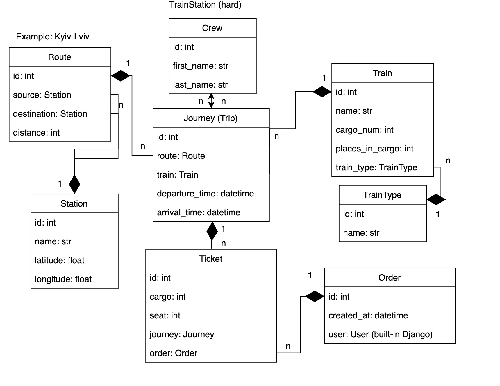

# Train Station API
API service for a train management system

Built using `Django REST Framework`

## Features

- JWT and simple token authentication

- Registration using e-mail

- Custom permission set

- Documentation using DRF Spectacular

- Ability to create, retrieve, update and delete railway stations, routes, trains and journeys

- Custom endpoint for uploading images to stations and trains

- Ability to order tickets for train journeys

## Getting started

*Rename `.env.sample` file to `.env` and update environment variables accordingly*

```shell
# clone the repo
git clone https://github.com/Esxoyne/train-station-api.git
cd train-station-api

# build & run the container
docker-compose up

# create a super user
docker-compose exec app python manage.py createsuperuser
```

## DB diagram


